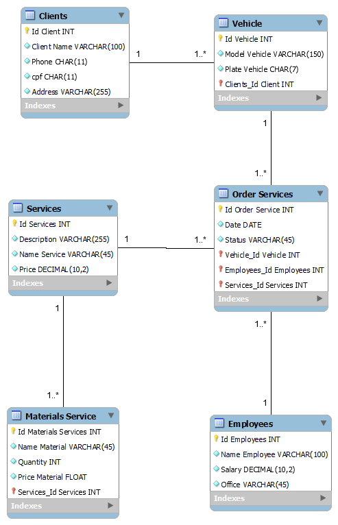

# Database for Workshop

This project consists of creating a database for an e-commerce system using MySQL. The database is designed to store information about customers, vehicles, services, service orders
,materials,employees as well as managing the relationship between these entities.

## Model Database ER

## Database Model
The database model consists of seven main tables:

1. **customers**: Stores customers' personal information, such as name, email address, telephone number and social security number.
2. **employees**: Stores customer addresses, associating them with the corresponding customers.
3. **vehicles**: Stores supplier information, such as CNPJ and company name;.
4. **services**: Stores information on the products offered in e-commerce, such as name, description, value and category.
5. **service orders**: Stores information on product storage locations.
6. **materials**: Establishes the relationship between suppliers and the products they supply, including the quantity supplied.

## Data entry

Fictitious data was inserted into all the tables to simulate a working workshop environment. The data includes information on customers, vehicles, services, service orders, materials.

## Consultations held

Several queries were carried out to demonstrate the database's functionalities. Some queries include:

1. Which product did each customer buy.

"""

   

"""

2. Where does each client live.

"""

    t;

"""

3. How many orders were placed by each customer.

"""

    
    
"""

4. List of product suppliers and stocks.

"""

   
"""

These queries are just examples of how the database can be consulted to obtain useful information for managing e-commerce.

